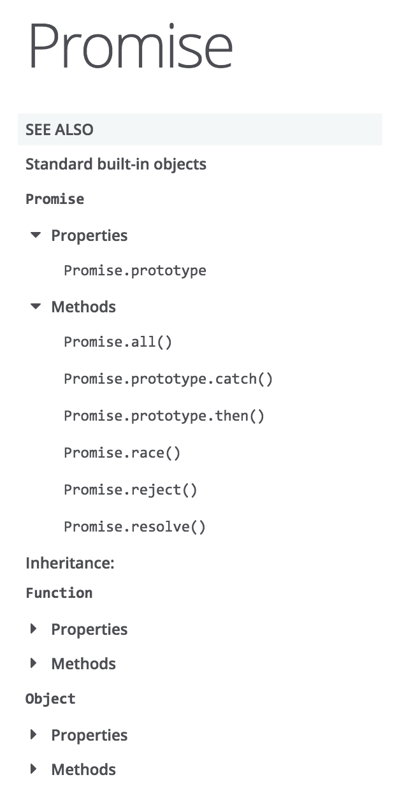

# Node.js Promise/a+实现

## Node.js 内置promise说明

从0.12开始部分支持，到4.0支持绝大部分了。


但性能比较低，所以一般是使用bluebird替换的。

## Node.js的promise库

Promise扩展类库除了实现了Promise中定义的规范之外，还增加了自己独自定义的功能。

按字母排序

| package | repo | alias
| ------- | ---- | -----
| [bluebird](https://www.npmjs.com/package/bluebird) | [petkaantonov/bluebird](https://github.com/petkaantonov/bluebird) | bb
| [es6-promise](https://www.npmjs.com/package/es6-promise) | [jakearchibald/es6-promise](https://github.com/jakearchibald/es6-promise) |
| [es6-promise-polyfill](https://www.npmjs.com/package/es6-promise-polyfill) [^1] | [lahmatiy/es6-promise-polyfill](https://github.com/lahmatiy/es6-promise-polyfill) |
| [es6-promises](https://www.npmjs.com/package/es6-promises) | [Octane/Promise](https://github.com/Octane/Promise) |
| [lie](https://www.npmjs.com/package/lie) | [calvinmetcalf/lie](https://github.com/calvinmetcalf/lie) |
| [native-promise-only](https://www.npmjs.com/package/native-promise-only) | [getify/native-promise-only](https://github.com/getify/native-promise-only) | npo
| [promiscuous](https://www.npmjs.com/package/promiscuous) | [RubenVerborgh/promiscuous](https://github.com/RubenVerborgh/promiscuous) |
| [promise](https://www.npmjs.com/package/promise) | [then/promise](https://github.com/then/promise) | then
| [promiz](https://www.npmjs.com/package/promiz) | [Zolmeister/promiz](https://github.com/Zolmeister/promiz) |
| [q](https://www.npmjs.com/package/q) | [kriskowal/q](https://github.com/kriskowal/q) |
| [rsvp](https://www.npmjs.com/package/rsvp) | [tildeio/rsvp.js](https://github.com/tildeio/rsvp.js) |
| [vow](https://www.npmjs.com/package/vow) | [dfilatov/vow](https://github.com/dfilatov/vow) |
| [when](https://www.npmjs.com/package/when) | [cujojs/when](https://github.com/cujojs/when) | w

[^1]: based on es6-promise, so excluded from the registery by default


Promise扩展类库数量非常的多，我们只介绍其中两个比较有名的类库。

- [kriskowal/q](https://github.com/kriskowal/q)

类库 Q 实现了 Promises 和 Deferreds 等规范。 它自2009年开始开发，还提供了面向Node.js的文件IO API Q-IO 等， 是一个在很多场景下都能用得到的类库。

- [petkaantonov/bluebird](https://github.com/petkaantonov/bluebird)

这个类库除了兼容 Promise 规范之外，还扩展了取消promise对象的运行，取得promise的运行进度，以及错误处理的扩展检测等非常丰富的功能，此外它在实现上还在性能问题下了很大的功夫。

Q 和 Bluebird 这两个类库除了都能在浏览器里运行之外，充实的API reference也是其特征。由于Bluebird的性能比较好，所以我们一般用Bluebird的时候会比较多。

Q等文档里详细介绍了Q的Deferred和jQuery里的Deferred有哪些异同，以及要怎么进行迁移 Coming from jQuery 等都进行了详细的说明。

Bluebird的文档除了提供了使用Promise丰富的实现方式之外，还涉及到了在出现错误时的对应方法以及 Promise中的反模式 等内容。

这两个类库的文档写得都很友好，即使我们不使用这两个类库，阅读一下它们的文档也具有一定的参考价值。

## 替换bluebird

> tj: bluebird is MASSIVE, why not use v8's?

bluebird是Node.js世界里性能最好的Promise/a+规范的实现模块，api非常齐全，功能强大，是原生Promise外的不二选择。


安装bluebird模块

```
$ npm i -S bluebird
```

见代码`hellopromise-bb.js`

```
// callbacks to promise
var fs = require("fs");
var Promise = require("bluebird");


function hello (file) {
  return new Promise(function(resolve, reject){
    fs.readFile(file, (err, data) => {
    	if (err) {
    		reject(err);
    	} else {
    		resolve(data.toString())
    	}
    });
  });
}

hello('./package.json').then(function(data){
  console.log('promise result = ' + data)
}).catch(function(err) {
  console.log(err)
})

```

它和之前的`hellopromise.js`执行结果是一模一样的，只差一行代码，即

```
var Promise = require("bluebird");
```

由此可以看出，Node.js原生的Promise和bluebird的实现是兼容的。只要掌握其中任何一个，几乎是0成本代价就可以学会。

这里用的是`var`来声明`Promise`，主要目的是为了当前文件使用，如果是koa或express这样的web项目里，使用全局替换呢？

其实也很简单，使用global全局替换就好，在应用的入口文件app.js里

```
global.Promise = require("bluebird");
```

性能会有明显的提升。

> 另外八卦一下，node之前版本的promise是有内存泄漏的，而使用bluebird不会遇到这样的坑

## Promisification

> Promisification means converting an existing promise-unaware API to a promise-returning API.

这里主要介绍一下bluebird的promisefy和promisifyAll

promisifyAll更彻底，对类方法或者对象方法都可以进行promisify处理，是最简单的包裹promisify的常用手段，比如

```
var Promise = require("bluebird");
var fs = Promise.promisifyAll(require("fs"));

fs.readFileAsync("./package.json", "utf8").then(function(contents) {
    console.log(contents);
}).catch(function(e) {
    console.error(e.stack);
});
```

再来个稍微复杂一些的，下面这个例子有abc 3个方法，每个都是普通函数，通过bluebird的promisifyAll让他变成promise对象，继而完成流程控制。

```
var Promise = require("bluebird");

var obj  = { 
  a: function(){
    console.log('a')
  },
  
  b: function(){
    console.log('b')
  },
  
  c: function(){
    console.log('c')
  }
}

Promise.promisifyAll(obj);

obj.aAsync().then(obj.bAsync()).then(obj.cAsync()).catch(function(err){
  console.log(err)
})
```

是不是非常简单？

危险常常来自便利处，大量的这样promisifyAll，会不会有性能问题呢？error被bluebird包裹了，我们自己想定制呢？

## Promise的5个api



1）构造方法

语法

> new Promise( /* executor */ function(resolve, reject) { ... } );

所有Promise只能这样创建，它的2个参数resolve和reject是唯一可以改变对象状态的方法。

- resolve会让状态从pending切换到fulfilled
- reject会让状态从pending切换到rejected（可选，不写也不算错）
  - Promise.prototype.then()可以当前操作的reject异常
  - Promise.prototype.catch()可以捕获全局的reject异常

备注：这里的resolve相当于Promise.resolve的别名，reject相当于Promise.reject的别名。

promise/api/a.js

```
new Promise(function(resolve){
    resolve(1);
}).then(function(value){
    console.log('new Promise ' + value);
});

Promise.resolve(1).then(function(value){
    console.log('Promise.resolve ' + value);
});

```

这2个示例resolve效果是一样的，可以看出Promise.resolve是便捷用法

promise/api/b.js

```
var error = new Error('this is a error')

new Promise(function(resolve, reject){
    reject(error);
}).catch(function(err){
    console.log('new Promise ' + err);
});

Promise.reject(error).catch(function(err){
    console.log('Promise.resolve ' + err);
});

```

这2个示例reject效果是一样的，可以看出Promise.reject是便捷用法


既然resolve和reject都有别名，那么我们能不能不适用构造函数，直接使用便捷用法呢？答案是不可以的，具体如下，见promise/api/c.js

```
// 以下做法是错误的
new Promise(function(){
    return Promise.resolve(1)
}).then(function(value){
    console.log('Promise.resolve 1 ' + value);
});

```

可能有的库会实现，但Node.js的原生Promise是不支持这样的写法的。

想便捷的话，一般采用下面这样的方法

promise/api/d.js

```
// 以下做法是正确的的
function hello(i){
    return Promise.resolve(i)
}

hello(1).then(function(value){
    console.log('Promise.resolve 1 ' + value);
});
```

这种写法可行原因是，Promise.resolve返回的是Promise对象，相当于`new Promise(resolve, reject)`

但是一定要注意，一旦的函数确定要返回Promise对象，就一定要全部可能分支都要返回Promise对象，不然出了问题非常难定位。

举个简单的例子，i是奇数或偶数做不一样的处理，一定要严谨。

promise/api/e.js

```
// 奇数和偶数
function hello(i){
  if (i % 2 == 0) {
    return Promise.resolve(i)
  } else {
    return Promise.reject(i)
  }
}

hello(1).then(function(value){
    console.log('Promise.reject 1 ' + value);
});

hello(2).then(function(value){
    console.log('Promise.resolve 1 ' + value);
});
```

其实按照规范Promise.resolve和Promise.reject还有更多用法，其他的给出语法定义，了解一下即可，没有特别需要说明的。

> Promise.resolve(value);
> Promise.resolve(promise);
> Promise.resolve(thenable);
> 
> Promise.reject(reason);

2）核心方法Promise.prototype.then()

语法

> p.then(onFulfilled, onRejected);
> 
> p.then(function(value) {
>    // fulfillment
>   }, function(reason) {
>   // rejection
> });

3）次核心方法Promise.prototype.catch()

> p.catch(onRejected);
> 
> p.catch(function(reason) {
>    // rejection
> });


4）工具方法

- Promise.all(iterable)
- Promise.race(iterable)

Promise.all 在接收到的所有的对象promise都变为 FulFilled 或者 Rejected 状态之后才会继续进行后面的处理， 与之相对的是 Promise.race 只要有一个promise对象进入 FulFilled 或者 Rejected 状态的话，就会继续进行后面的处理。

简单点就说，all是所有都执行完成，再执行then，而race语义上相当于once，有个执行完成后就会执行then。一定要注意，它们是并发的，只是结果处理的点不一样而已。

它们的使用方法是一样，接收一个promise对象数组为参数。

all.js

```
'use strict'

let sleep = (time, info) => {
  return new Promise(function (resolve) {
    setTimeout(function () {
        console.log(info)
        resolve('this is ' + info)
    }, time)
  })
}

let loser = sleep(1000, 'loser')
let winner = sleep(4, 'winner')

// main
Promise.all([winner, loser]).then(value => {
    console.log("所有都完成后会执行then，它们是并行的哦: " + value)    // => 'this is winner'
})

```

执行结果

```
$ node api/all.js 
winner
loser
所有都完成后会执行then，它们是并行的哦: this is winner,this is loser
```

race.js

```
'use strict'

let sleep = (time, info) => {
  return new Promise(function (resolve) {
    setTimeout(function () {
        console.log(info)
        resolve('this is ' + info)
    }, time)
  })
}

let loser = sleep(1000, 'loser')
let winner = sleep(4, 'winner')

// main
Promise.race([winner, loser]).then(value => {
    console.log("只要有一个成功，就会执行then，和顺序无关，只看执行速度: " + value)    // => 'this is winner'
})
```

执行结果

```
$ node api/race.js
winner
只要有一个成功，就会执行then，和顺序无关，只看执行速度: this is winner
loser
```
## 参考阅读

1. [Promises/A]( http://wiki.commonjs.org/wiki/Promises/A)
2. [Promises/B]( http://wiki.commonjs.org/wiki/Promises/B)
3. [Promises/D]( http://wiki.commonjs.org/wiki/Promises/D)
4. [Promisejs]( https://www.promisejs.org/)
5. [Promises/A+]( https://promisesaplus.com/)
6. [As soon as possible]( https://github.com/kriskowal/asap)
7. [A minimalist implementation of a javascript promise]( https://gist.github.com/unscriptable/814052)
8. [Lightweight implementation of promises]( http://stackoverflow.com/questions/12923533/lightweight-implementation-of-promises)
9. [How is a promise/defer library implemented?]( http://stackoverflow.com/questions/17718673/how-is-a-promise-defer-library-implemented)
10. [Basic Javascript promise implementation attempt]( http://stackoverflow.com/questions/23772801/basic-javascript-promise-implementation-attempt/23785244#23785244)
11. [You're Missing the Point of Promises]( https://blog.domenic.me/youre-missing-the-point-of-promises/)
12. [Boom! Promises/A+ Was Born]( http://www.slideshare.net/domenicdenicola/boom-promisesa-was-born)
13. [Futures and promises]( http://en.wikipedia.org/wiki/Futures_and_promises)
14. [JavaScript Promises - There and back again]( http://www.html5rocks.com/zh/tutorials/es6/promises/)
15. [Promise 迷你书](https://github.com/liubin/promises-book)
16. https://blog.domenic.me/youre-missing-the-point-of-promises/
17. https://strongloop.com/strongblog/promises-in-node-js-with-q-an-alternative-to-callbacks/
18. https://github.com/kriskowal/q/wiki/General-Promise-Resources
19. https://www.w3.org/2001/tag/doc/promises-guide
10. https://github.com/bevacqua/promisees


源码 https://github.com/calvinmetcalf/lie/blob/master/lib/index.js