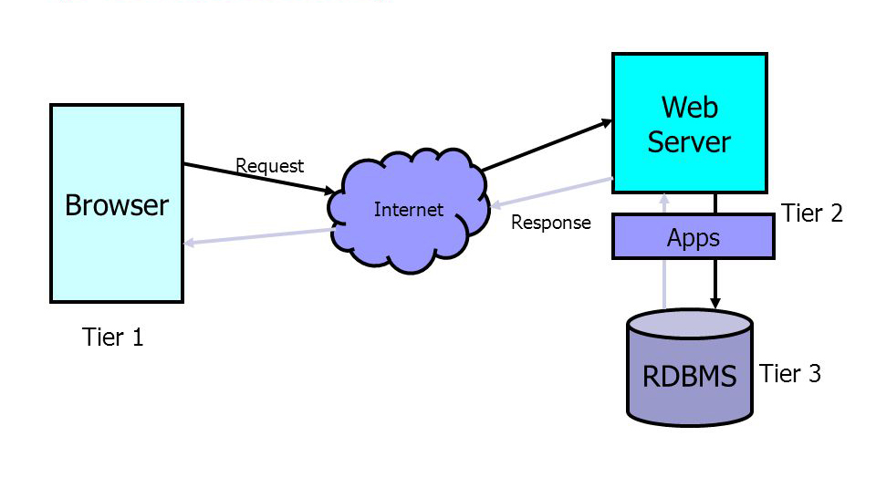
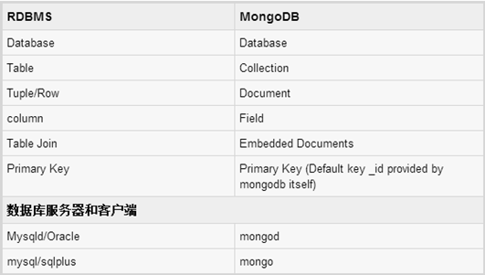

# DB相关

从上章节我们知道如何在express里获取值，无论表单还是ajax，那么取过来的值用来干嘛呢？这就要看具体业务逻辑处理了。一般而言，都会把这些值进行数据库存储、更新等操作的。为了保持最小化问题的思路，我们在本章里，只讲db操作，在下一章demo里会整合http和db

本节先讲什么是数据库，继而介绍3种最为常见的mysql、mongodb和redis，希望能够让读者理解他们之间的差别，以便于技术选型，接下来会讲一下mvc里m 和 MEAN里mongodb的种种用法。

## 什么是数据库？

数据库指的是以一定方式储存在一起、能为多个用户共享、具有尽可能小的冗余度的特点、是与应用程序彼此独立的数据集合。

回想一下我们之前讲的三层架构模型



三层架构(3-tier architecture) 通常意义上的三层架构就是将整个业务应用划分为:

- 表现层(Presentation layer)
- 业务逻辑层(Business Logic Layer)
- 数据访问层(Data access layer)。

其中数据访问层指的就是对数据库的存取。我们想一下，大量的数据要怎么样存储呢？

## 分类

数据库按照存取方式，大致可以分成2类：关系型数据库和NoSQL

## RDBMS

关系数据库（英语：Relational database），是创建在关系模型基础上的数据库，借助于集合代数等数学概念和方法来处理数据库中的数据。现实世界中的各种实体以及实体之间的各种联系均用关系模型来表示。关系模型是由埃德加·科德于1970年首先提出的，并配合“科德十二定律”。现如今虽然对此模型有一些批评意见，但它还是数据存储的传统标准。标准数据查询语言SQL就是一种基于关系数据库的语言，这种语言执行对关系数据库中数据的检索和操作。 关系模型由关系数据结构、关系操作集合、关系完整性约束三部分组成。

当前主流的关系型数据库有Oracle、DB2、Microsoft SQL Server、MySQL等。

核心要点

- ER模型
- 关系代数
- 基本概念：数据库（db） -> 表（table） -> 记录（record）-> 字段
- SQL
- 三范式

### ER模型

实体关系模型(Entity-Relationship Model)，简称E-R Model是Peter P.S Chen博士于1976年提出的一套数据库的设计工具，他运用真实世界中事物与关系的观念，来解释数据库中的抽象的数据架构。实体关系模型利用图形的方式(实体-关系图(Entity-Relationship Diagram))来表示数据库的概念设计，有助于设计过程中的构思及沟通讨论。

关系模型就是指二维表格模型,因而一个关系型数据库就是由二维表及其之间的联系组成的一个数据组织。

### 关系代数

关系代数是一阶逻辑的分支，是闭合于运算下的关系的集合。运算作用于一个或多个关系上来生成一个关系。关系代数是计算机科学的一部分。

在纯数学中的关系代数是有关于数理逻辑和集合论的代数结构。

关系代数在1970年E.F. Codd发表数据的关系模型之前很少受到注意。Codd曾是皮尔士选集编辑者Arthur W. Burks的博士研究生。Codd提议这样一种代数作为数据库查询语言的基础。第一个基于Codd的代数的查询语言是ISBL，许多作者都认同这个先驱的工作展示了一个使Codd的想法成为有用语言的方式。商务系统12是追随ISBL先例的短命工业级实力的关系DBMS。在1998年Chris Date和Hugh Darwen提议了一种叫Tutorial D的语言，意图用于教学关系数据库理论，它的查询语言也吸取了ISBL的想法。Rel是Tutorial D的一个实现。即使SQL的查询语言也松散的基于了关系代数，尽管SQL中的操作数（表）不完全是关系，很多有用的关于关系代数的理论在SQL对应者中不成立。

因为关系被解释为某个谓词的外延，关系代数的每个运算在谓词演算中都有对应者。例如，自然连接是逻辑AND（\land）的对应者。如果关系R和S分别表示谓词p1和p2的外延，则R和S的自然连接（R \bowtie S）是表示谓词p1 \land p2的外延的关系。

认识到Codd的代数事实上关于一阶逻辑不完备是很重要的。实现它会引起不可逾越的特定计算困难。为了克服这些困难，他限制操作数为有限关系，并提议了对否定（NOT）和析取（OR）的有限支持。类似的限制在很多其他基于逻辑的计算机语言中也能见到。Codd定义术语关系完备性来称呼一个语言除了他提议的限制之外关于一阶逻辑是完备的。在实践中这些限制对他的关系代数用于数据库用途的适用性没有不利作用。

- 关系代数的9种操作： 

    关系代数中包括了：并、交、差、乘、选择、投影、联接、除、自然联接等操作。 

五个基本操作： 
    并(∪)、差(-)、笛卡尔积(×)、投影(σ)、选择(π) 

四个组合操作： 
    交(∩)、联接(等值联接)、自然联接(R S)、除法(÷) 
    
注2：等值连接表示先做笛卡尔积(×)之后，对相应列进行选择或等值关联后的结果(仅筛选行、不筛选列) 
注2：自然连接表示两个关系中若有相同名称的属性，则自动作为关联条件，且仅列出一列 
  
- 关系代数表达式：     由关系代数运算经有限次复合而成的式子称为关系代数表达式。这种表达式的运算结果仍然是一个关系。可以用关系代数表达式表示对数据库的查询和更新操作。 


这部分是数据库理论基础，需要的可以去看一下[关系代数 (数据库)](https://zh.wikipedia.org/zh-cn/%E5%85%B3%E7%B3%BB%E4%BB%A3%E6%95%B0_(%E6%95%B0%E6%8D%AE%E5%BA%93))

### 基本概念

```
RDBMS -> 数据库（db） -> 表（table） -> 记录（record）-> 字段（field）
```

RDBMS 

```
指的是关系型数据库管理系统。
```

数据库（db）

```
访问的数据集合称为数据库（Database，DB）
```

表（table）

```
RDBMS 中的数据存储在被称为表（tables）的数据库对象中。
表是数据的矩阵。在一个数据库中的表看起来像一个简单的电子表格。
表是相关的数据项的集合，它由列和行组成。
```

记录（record）

```
表里的一行称为记录，是一组相关的数据，例如一条用户订阅的数据，一条用户发表的帖子。
```

字段（field）

```
表里的一列成为字段
一列(数据元素) 包含了相同的数据, 例如用户表里会有用户名列，密码列等。
```


### SQL

SQL是Structured Query Language(结构化查询语言)的缩写。

- SQL 指结构化查询语言
- SQL 使我们有能力访问数据库
- SQL 是一种 ANSI 的标准计算机语言

SQL包含四个部分：数据查询语言（DQL）、数据定义语言（DDL）、数据操纵语言（DML）、数据控制语言（DCL）

SQL有如下指令（不同数据库会有差别）：

    SELECT · INSERT · UPDATE · MERGE · DELETE · JOIN · UNION · CREATE · DROP · Begin work · COMMIT · ROLLBACK · TRUNCATE · ALTER


### 三范式

设计关系数据库时，遵从不同的规范要求，设计出合理的关系型数据库，这些不同的规范要求被称为不同的范式，各种范式呈递次规范，越高的范式数据库冗余越小。

范式是符合某一种级别的关系模式的集合。关系数据库中的关系必须满足一定的要求，即满足不同的范式。

目前关系数据库有六种范式：第一范式（1NF）、第二范式（2NF）、第三范式（3NF）、巴斯-科德范式（BCNF）、第四范式(4NF）和第五范式（5NF，又称完美范式）。满足最低要求的范式是第一范式（1NF）。在第一范式的基础上进一步满足更多规范要求的称为第二范式（2NF），其余范式以次类推。一般说来，数据库只需满足第三范式(3NF）就行了。

没有冗余的数据库未必是最好的数据库，有时为了提高运行效率，就必须降低范式标准，适当保留冗余数据。

具体做法是：在概念数据模型设计时遵守第三范式，降低范式标准的工作放到物理数据模型设计时考虑。降低范式就是增加字段，允许冗余。（最典型的就是在一些数据表中不仅存作为外键的user_id,同样存user_name这样虽然违反数据库范式增加了user_name字段，但是却提高了效率，减少了获取user_id后再去user表中获取user name的操作）

所以实际中，我们只需要考虑数据库满足第三范式就可以了,下面以最通俗的方式来解释数据库的范式。
      
- 第一范式（1NF）：属性不可分
- 第二范式（2NF）：符合1NF，并且非主属性完全依赖于码
- 第三范式（3NF）：符合2NF，并且消除传递依赖

## NoSQL

NoSQL(NoSQL = Not Only SQL )，意即“不仅仅是SQL”，是一项全新的数据库革命性运动，泛指非关系型的数据库.

NoSQL一词首先是Carlo Strozzi在1998年提出来的，指的是他开发的一个没有SQL功能，轻量级的，开源的关系型数据库。注意，这个定义跟我们现在对NoSQL的定义有很大的区别，它确确实实字如其名，指的就是“没有SQL”的数据库。不过，NoSQL的发展慢慢偏离了初衷，Carlo Strozzi也发觉，其实我们要的不是”no sql”，而应该是”no relational”，也就是我们现在常说的非关系型数据库了。
2009年初，Johan Oskarsson举办了一场关于开源分布式数据库的讨论，Eric Evans在这次讨论中再次提出了NoSQL一词，用于指代那些非关系型的，分布式的，且一般不保证遵循ACID原则的数据储存系统的出现和兴起。Eric Evans使用NoSQL这个词，并不是因为字面上的“没有SQL”的意思，他只是觉得很多经典的关系型数据库名字都叫”**SQL”（例如MySQL，MS SQL，PostgreSQL），所以为了表示跟这些关系型数据库在定位上的截然不同，就用了”NoSQL”一词。
Wikipedia上对NoSQL的定义是这样的：NoSQL是一项运动，这个运动推动了广义定义的非关系型数据储存系统的发展，并破除了长久以来关系型数据库一家独大的局面。论文和研究中一般将这些数据库称为结构化储存系统。
- 1、High performance - 对数据库高并发读写的需求
- 2、Huge Storage - 对海量数据的高效率存储和访问的需求
- 3、High Scalability && High Availability- 对数据库的高可扩展性和高可用性的需求

在上面提到的“三高”需求面前，关系数据库遇到了难以克服的障碍，而对于web2.0网站来说，关系数据库的很多主要特性却往往无用武之地，例如：

- 1、数据库事务一致性需求
- 2、数据库的写实时性和读实时性需求
- 3、对复杂的SQL查询，特别是多表关联查询的需求

典型的NoSQL数据库

- 临时性键值存储（memcached、Redis）
- 永久性键值存储（ROMA、Redis）
- 面向文档的数据库（MongoDB、CouchDB）
- 面向列的数据库（Cassandra、HBase）

## 为什么NoSQL变得流行

JavaEye上robbin的一篇文章（为什么要用非关系数据库？）很好地讨论了这个问题，这里只列出几个要点。

随着互联网web2.0网站的兴起，非关系型的数据库现在成了一个极其热门的新领域，非关系数据库产品的发展非常迅速。而传统的关系数据库在应付web2.0网站，特别是超大规模和高并发的SNS类型的web2.0纯动态网站已经显得力不从心，暴露了很多难以克服的问题，例如： 

1、High performance - 对数据库高并发读写的需求 

web2.0网站要根据用户个性化信息来实时生成动态页面和提供动态信息，所以基本上无法使用动态页面静态化技术，因此数据库并发负载非常高，往往要达到每秒上万次读写请求。关系数据库应付上万次SQL查询还勉强顶得住，但是应付上万次SQL写数据请求，硬盘IO就已经无法承受了。其实对于普通的BBS网站，往往也存在对高并发写请求的需求，例如像网站的实时统计在线用户状态，记录热门帖子的点击次数，投票计数等，因此这是一个相当普遍的需求。 

2、Huge Storage - 对海量数据的高效率存储和访问的需求 

类似Facebook，twitter，Friendfeed这样的SNS网站，每天用户产生海量的用户动态，以Friendfeed为例，一个月就达到了2.5亿条用户动态，对于关系数据库来说，在一张2.5亿条记录的表里面进行SQL查询，效率是极其低下乃至不可忍受的。再例如大型web网站的用户登录系统，例如腾讯，盛大，动辄数以亿计的帐号，关系数据库也很难应付。 

3、High Scalability && High Availability- 对数据库的高可扩展性和高可用性的需求 

在基于web的架构当中，数据库是最难进行横向扩展的，当一个应用系统的用户量和访问量与日俱增的时候，你的数据库却没有办法像web server和app server那样简单的通过添加更多的硬件和服务节点来扩展性能和负载能力。对于很多需要提供24小时不间断服务的网站来说，对数据库系统进行升级和扩展是非常痛苦的事情，往往需要停机维护和数据迁移，为什么数据库不能通过不断的添加服务器节点来实现扩展呢？ 

在上面提到的“三高”需求面前，关系数据库遇到了难以克服的障碍，而对于web2.0网站来说，关系数据库的很多主要特性却往往无用武之地，例如： 

1、数据库事务一致性需求 

很多web实时系统并不要求严格的数据库事务，对读一致性的要求很低，有些场合对写一致性要求也不高。因此数据库事务管理成了数据库高负载下一个沉重的负担。 

2、数据库的写实时性和读实时性需求 

对关系数据库来说，插入一条数据之后立刻查询，是肯定可以读出来这条数据的，但是对于很多web应用来说，并不要求这么高的实时性，比方说发一条消息之后，过几秒乃至十几秒之后，我的订阅者才看到这条动态是完全可以接受的。 

3、对复杂的SQL查询，特别是多表关联查询的需求 

任何大数据量的web系统，都非常忌讳多个大表的关联查询，以及复杂的数据分析类型的复杂SQL报表查询，特别是SNS类型的网站，从需求以及产品设计角度，就避免了这种情况的产生。往往更多的只是单表的主键查询，以及单表的简单条件分页查询，SQL的功能被极大的弱化了。 


### 总结

关系型数据库与NoSQL数据库并非对立而是互补的关系，即通常情况下使用关系型数据库，在适合使用NoSQL的时候使用NoSQL数据库，让NoSQL数据库对关系型数据库的不足进行弥补。

## 什么是mongodb？

mongodb是用C++开发的面向文档的数据库，也就是反传统的数据库范式来设计的，把相关的对象都记录到一个文档里，每个文档内是schema-free的，也就是列名可以自由定义，比较灵活，特别是面对业务逻辑多变的应用场景十分给力。数据以BSON(类似JSON)的格式二进制存储。不好的地方就是可能带来一定的数据冗余和存储开销。

很明显，MongoDB这种面向文档的数据库和传统的关系型数据库的设计思路是差别很大的，因为每个文档都包含了所有信息，和其他文档是没有关联的，这样传统的Join操作就完全没必要了，也正是因为去除了这种“关系”，使得MongoDB的水平拆分更加容易，这也是面对海量数据的一个很好的处理思路。另外，MongoDB的索引机制和MySQL等数据库是一样的，可以利用传统的关系型数据库的经验来使用MongoDB的索引。

不像其他很多NoSQL产品由个别工程师根据应用场景开发出来，MongoDB是有一个专门的公司10gen来维护。有一点要注意的是，MongoDB自己是不管理内存的，无法指定内存大小，完全交给操作系统来管理，因此有时候是不可控的，在生产环境使用必须在OS层面监控内存使用情况。

MongoDB、CouchDB属于这种类型，它们属于NoSQL数据库，但与键值存储相异。

- （1）不定义表结构

即使不定义表结构，也可以像定义了表结构一样使用，还省去了变更表结构的麻烦。

- （2）可以使用复杂的查询条件 

跟键值存储不同的是，面向文档的数据库可以通过复杂的查询条件来获取数据，虽然不具备事务处理和Join这些关系型数据库所具有的处理能力，但初次以外的其他处理基本上都能实现。


优势：

- 快速！（当然，这和具体的应用方式有关，通常来说，它比一般的关系型数据库快5位左右。）
- 很高的可扩展性 – 轻轻松松就可实现PB级的存储（但是可能我们并不需要PB级的存储，10TB可能就够了）
- 他有一个很好的 replication 模式 (replica sets)
- 有很完善的多语言的 API，尤其是Node.js
- 他的存储格式是Json的，这对Java来说非常好处理，对javascirpt亦然。
- 运维起来非常方便，你不用专门为它安排一个管理员（当然是前期）
- 它有一个非常活跃的社区
- 他的版本控制非常清楚
- MongoDB 背后的公司（10gen）已经准备好了明天在 MongoDB 上面的投入的资金了

核心要点

- 基本概念：数据库 -> collection -> document -> 字段
- 面向文档
- NoSQL

## 为什么选用mongodb？

在项目设计的初期，我当时有了这样的想法，同时也是在满足下面几个条件的情况下来选择最终的nosql方案的：

- 1、需求变化频繁：开发要更加敏捷，开发成本和维护成本要更低，要能够快速地更新进化，新功能要在最短的周期内上线。
- 2、客户端/api支持，因为这直接影响开发效率
- 3、部署简单
- 4、扩展能力强
- 5、节省系统资源，对cpu等资源耗费较小

满足这些要求的nosql方案，就剩下了mongodb和redis了，对于redis，5种数据结构足够强大，但对于关系表述上来说，不是特别友好不好，处理key和处理类似JSON的文档形式相比，后者优势尤其明显，这一点对于后来两者之间的选择，起到了决定性作用。

当然，Redis对丰富数据类型的操作很吸引人，可以轻松解决一些应用场景，其读写性能也相当高，之前的版本是存储和内存挂钩是挂钩的，这样如果存储大量的数据需要消耗太多的内存，当然现在的版本已经么有这样的问题了。

MongoDB是一个面向文档的数据库，目前由10gen开发并维护，，它的功能丰富，齐全，完全可以替代MySQL。

mongodb的一些很好的亮点：


1、使用JSON风格语法，易于掌握和理解

MongoDB使用JSON的变种BSON作为内部存储的格式和语法。针对MongoDB的操作都使用JSON风格语法，客户端提交或接收的数据都使用JSON形式来展现。相对于SQL来说，更加直观，容易理解和掌握。这也是根据我自己项目的情况出发，最后选择了mongodb的一个原因。

2、Schema-less，支持嵌入子文档

MongoDB是一个Schema-free的文档数据库。一个数据库可以有多个Collection，每个Collection是Documents的集合。Collection和Document和传统数据库的Table和Row并不对等。无需事先定义Collection，随时可以创建。Collection中可以包含具有不同schema的文档记录。 这意味着，你上一条记录中的文档有3个属性，而下一条记录的文档可以有10个属性，属性的类型既可以是基本的数据类型(如数字、字符串、日期等)，也可以是数组或者散列，甚至还可以是一个子文档(embed document)。这样，可以实现逆规范化(denormalizing)的数据模型，提高查询的速度。

3、简单易用的查询方式

直接使用JSON，支持范围查询、正则表达式查询。

4、CRUD更加简单，支持in-place update

只要定义一个数组，然后传递给MongoDB的insert/update方法就可自动插入或更新;对于更新模式，MongoDB支持一个upsert选项，即：“如果记录存在那么更新，否则插入”。MongoDB的update方法还支持Modifier，通过Modifier可实现在服务端即时更新，省去客户端和服务端的通讯。这些modifer可以让MongoDB具有和Redis、Memcached等KV类似的功能：较之MySQL，MonoDB更加简单快速。Modifier也是MongoDB可以作为对用户行为跟踪的容器。在实际中使用Modifier来将用户的交互行为快速保存到MongoDB中以便后期进行统计分析和个性化定制

5、所有的属性类型都支持索引，甚至数组

这可以让某些任务实现起来非常的轻松。在MongoDB中，“_id”属性是主键，默认MongoDB会对_id创建一个唯一索引。

6、性能高效，速度快

 MongoDB使用c++/boost编写，在多数场合，其查询速度对比MySQL要快的多，对于CPU占用非常小。部署也很简单，对大多数系统，只需下载后二进制包解压就可以直接运行，几乎是零配置。

7、服务端脚本和Map/Reduce

MongoDB允许在服务端执行脚本，可以用Javascript编写某个函数，直接在服务端执行，也可以把函数的定义存储在服务端，下次直接调用即可。MongoDB不支持事务级别的锁定，对于某些需要自定义的“原子性”操作，可以使用Server side脚本来实现，此时整个MongoDB处于锁定状态。Map/Reduce也是MongoDB中比较吸引人的特性。Map/Reduce可以对大数据量的表进行统计、分类、合并的工作，完成原先SQL的GroupBy等聚合函数的功能。并且Mapper和Reducer的定义都是用Javascript来定义服务端脚本。

### 基本概念

```
数据库（db） -> 集合（collection） -> 文档（document） -> 字段（field）
```

mongodb

```
是面向文档的数据库，是NoSQL数据库里重要的一员
```

数据库（db）

```
访问的所有集合称为数据库（Database，DB）
```

集合（collection）

```
mongodb 中的数据存储在被称为集合（collection）的数据库对象中。
集合（collection）是数据的矩阵。和关系数据库里的表一样的。
集合（collection）是相关的文档数据项的集合，它由列和行组成。

```

文档（document）

```
集合（collection）里的一行称为记录，是一组相关的数据，schema-free的，也就是列名可以自由定义
就是说同一种集合里，可以有不一样的列，可能有的行里列多，有的行里列很少，甚至列名都可以在其他行里没有
每个文档内是schema-free的，也就是列名可以自由定义，比较灵活


```

记录（record）

```
表里的一行称为记录，是一组相关的数据，例如一条用户订阅的数据，一条用户发表的帖子。
关系型数据库里记录是只有数据，没有列名，而mongodb里，字段名和数据都在记录里

{
    "_id" : ObjectId("56f948267591f95119c9e934"),
    "user_id" : ObjectId("569890600c64b47176e6839e"),
    "user_name" : "L",
    "name" : "越越",
    "mobile" : "13554356532",
    "province" : "内蒙古自治区",
    "city" : "巴彦淖尔市",
    "area" : "乌拉特前旗",
    "detail" : "哈哈哈",
    "is_deleted" : false,
    "updated_at" : ISODate("2016-03-28T15:05:10.168Z"),
    "created_at" : ISODate("2016-03-28T15:05:10.168Z"),
    "by_count" : 7,
    "__v" : 0
}
```

字段（field）

```
文档（document）里的一列成为字段
一列(数据元素) 包含了k/v数据, 例如用户表里会有`name:用户名列`，`passwor:密码列`等。
```

## 对比




观察下最重要的一点就是我们关系数据库中的表与字段被合集与文档的概念给替代了，Mongo不在具有主键的关系了，数据保存都是放在文档中用JSON风格键值对风格的文件形式存放

更多请见 http://blog.nosqlfan.com/html/3548.html

