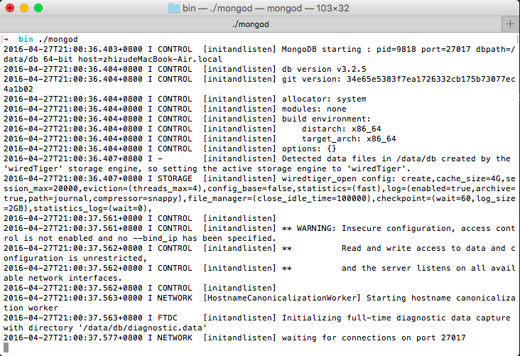
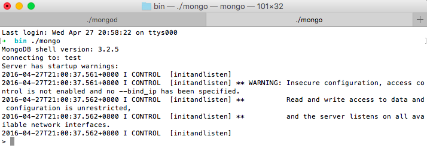

# mongodb安装

本章节讲的是mongodb的安装，以及客户端使用，简单的操作

## 安装

### for mac

- 下载MongoDB
首先到 MongoDB 官网 www.mongodb.org 下载最新版本mongodb-osx-x86_64-3.2.6.tgz (可能已经更新到其它版本)

- 安装
解压，然后把解压后文件复制到自己想安装的目录下即可，可以把目录重命名，例如把mongodb-osx-x86_64-3.2.5重命名为mongodb,或用shell命令行 `mv 源文件 目标文件`。

- 配置
在根目录下新建数据目录 data，在 data 内部新建 db 目录，或使用shell命令行 。
打开终端, cd 到 mongodb 的根目录下,
```
mkdir -p .data/db
```
 然后输入
```
sudo chown -R 输入计算机用户名 /data
```

TODO:

- 使用 Homebrew 安装 MongoDB

1. 首先升级 Homebrew的 package 数据库.
在系统的 shell 中输入:
```
brew update
```

2. 安装 MongoDB.
使用 brew 安装有几种选择，你可以根据需要来安装MongoDB。

- 安装二进制 MongoDB

使用如下命令:

```
brew install mongodb
```

- 从TLS/SSL支持源建立MongoDB
从源文件建立MongoDB且包括TLS/SSL的支持, 使用如下命令:

```
brew install mongodb --with-openssl
```

- 安装最新开发版本的 MongoDB，用于开发和测试。
安装命令如下:

```
brew install mongodb --devel
```

### for ubuntu

https://docs.mongodb.org/manual/tutorial/install-mongodb-on-ubuntu/


- 支持平台

MongoDB 仅长期支持64位的 Ubuntu releases，这意味着目前只有 12.04 LTS (Precise Pangolin) 和 14.04 LTS (Trusty Tahr)两个版本的Ubuntu被支持。

- Packages

在 MongoDB 官方仓库中提供如下的包：
```
mongodb-org	// 完成下面四个部分的安装
mongodb-org-server	// mongod 后台程序、相关配置和初始化脚本
mongodb-org-mongos	// mongos 后台程序
mongodb-org-shell	// mongo shell.
mongodb-org-tools	// MongoDB 工具: mongoimport bsondump, mongodump, mongoexport, mongofiles, mongooplog, mongoperf, mongorestore, mongostat, and mongotop.
```

配置文件 /etc/mongod.conf 绑定的默认 IP 是 127.0.0.1 。如果想变动初始化设置请提前做好备份。

- 初始化脚本

 mongodb-org package 包括各类初始化脚本，包括/etc/init.d/mongod。可以使用这些脚本启动、停止和重新启动后台进程。

MongoDB 使用 /etc/mongod.conf 配置文件和初始化脚本。 可参照配置文件说明来进行设置。 
对于MongoDB@3.2.6，没有 mongos 的初始化脚本，mongos 进程只在分片中使用。那么在这个环境下，你可以使用自己电脑中mongos初始化脚本的mongod初始化脚本。参照mongos使用说明来进行详细配置。
 

- 安装 MongoDB

想要安装最新版本，请参照之前版本的文件，例如要安装3.2，你可以参照3.0版本文件。

1. 输入公共秘钥使用包管理系统

使用 Ubuntu 包管理工具 (i.e. dpkg and apt) 确保包的 一致性和可靠性 by requiring that distributors sign packages with GPG keys. 使用如下命令进入MongoDB的公共GPG秘钥:
```
sudo apt-key adv --keyserver hkp://keyserver.ubuntu.com:80 --recv EA312927
```
2. 为MongoDB创建文件列表

创建 /etc/apt/sources.list.d/mongodb-org-3.2.list 文件列表。注意要根据不同的Ubuntu版本使用相应的命令，如下：

```
// Ubuntu 12.04
echo "deb http://repo.mongodb.org/apt/ubuntu precise/mongodb-org/3.2 multiverse" | sudo tee /etc/apt/sources.list.d/mongodb-org-3.2.list

// Ubuntu 14.04
echo "deb http://repo.mongodb.org/apt/ubuntu trusty/mongodb-org/3.2 multiverse" | sudo tee /etc/apt/sources.list.d/mongodb-org-3.2.list
```

3. 重新加载本地数据库

使用如下命令:
```
sudo apt-get update
```

4. 安装MongoDB包

你可以安装最新的稳定 MongoDB 版本或特定版本.

安装最新稳定 MongoDB 版本，使用如下命名:
```
sudo apt-get install -y mongodb-org
Install a specific release of MongoDB.
```
安装特定版本，必须分别指定相应package的版本号，例如：

```
sudo apt-get install -y mongodb-org=3.2.6 mongodb-org-server=3.2.6 mongodb-org-shell=3.2.6 mongodb-org-mongos=3.2.6 mongodb-org-tools=3.2.6
```
如果只安装 mongodb-org=3.2.6 ，不安装其余的package，则会忽略你的指定来安装最新的package。

固定特定的 MongoDB 版本.

尽管能指定任意版本的 MongoDB,  当有新版本发布 apt-get 将升级包。为阻止盲目升级，固定package，固定当前已安装的版本,可按顺序使用如下命令:

```
echo "mongodb-org hold" | sudo dpkg --set-selections
echo "mongodb-org-server hold" | sudo dpkg --set-selections
echo "mongodb-org-shell hold" | sudo dpkg --set-selections
echo "mongodb-org-mongos hold" | sudo dpkg --set-selections
echo "mongodb-org-tools hold" | sudo dpkg --set-selections
```

- 运行 MongoDB 

默认的 MongoDB 实例数据存储在 /var/lib/mongodb ，日志文件存储在  /var/log/mongodb目录中 。

如果你改变用户来运行MongoDB进程，你必须到 /var/lib/mongodb 和 /var/log/mongodb目录中改变该用户的使用权限。

1. 启动 MongoDB.

使用如下命令来启动:
```
sudo service mongod start
```

2. 证明 MongoDB 已经启动成功

在 /var/log/mongodb/mongod.log 日志文件中看到如下内容时说明启动成功。

[initandlisten] waiting for connections on port <port>
where <port> is the port configured in /etc/mongod.conf, 27017 by default.

3. 停止 MongoDB.

当需要停止MongoDB进程时使用如下命令:
```
sudo service mongod stop
```

4. 重新启动 MongoDB.

使用如下命令:
```
sudo service mongod restart
```

5. 使用 MongoDB.

MongoDB 在各种驱动版本中提供 Getting Started Guides（GSG） .

在生产环境中配置MongoDB之前，要认真查看说明文档。
然后，停止MongoDB，在运行mongod实例的终端按 Control+C 退出。

- 卸载 MongoDB

要从系统中完全删除 MongoDB，你必须删除MongoDB应用程序、配置文件、所有数据和日志文件。

注意：这将完全移除MongoDB，包括它的配置和所有的数据库，并且该操作是不可恢复的，所以请谨慎操作或事先做好备份。
1. 停止 MongoDB.

使用如下命令来停止mongod:
```
sudo service mongod stop
```

2. 删除安装包

删除所有之前安装过的 package.
```
sudo apt-get purge mongodb-org*
```

3. 删除数据目录

删除 MongoDB 数据库和日志文件。

```
sudo rm -r /var/log/mongodb
sudo rm -r /var/lib/mongodb
```

## 启动与关闭

- shell启动
- mh
- 查看进程
- 关闭

### 通过shell进行启动
```
  #! /bin/bash

  mkdir -p ~/mongo/db
  mkdir -p ~/mongo/pids
  mkdir -p ~/mongo/logs

  # remove lock file
  [ -f ~/mongo/db/mongod.lock ] && rm -rf ~/mongo/db/mongod.lock

  touch ~/mongo/pids/mongodb.pid

  # mongod --bind_ip 192.168.1.100 --port 27017 --dbpath tmp/db --logpath tmp/logs/mongodb.log --pidfilepath tmp/pids/mongodb.pid
  nohup mongod --bind_ip 127.0.0.1 --port 27017 --dbpath ~/mongo/db --logpath ~/mongo/logs/mongodb.log --pidfilepath ~/mongo/pids/mongodb.pid > ~/mongo/logs/mongod.log 2>&1 &
```

### mongohere便捷启动


```
$ [sudo] npm install -g mh
```

#### Usage 

#### 当前目录启动mongodb

在新建目录执行

```
$ mh
```

它会创建tmp目录

### 全局启动mongodb


```
$ mhg
```

它会创建~/mongo/目录，当前用户下起mongo服务，即用户下全局共享


### 进程查看

在进程里查询是否存在mongod进程

```
$ ps -ef|grep mongod
```

如果没有数据，即没有启动mongodb

此时，执行

```
$ mhg

start mongo here global success!
```

### 停止或关闭

根据进程杀死

```
$ ps -ef|grep mongod|awk '{print $2}'|xargs kill -9
```

根据端口杀死

```
$ npm i -g kp
$ kp 27017
```


## 客户端

robomongo

## 基础操作

在robo里执行各种语句

- 启动 MongoDB

输入 ls 显示 mongodb 根目录下文件，看到有一个 bin 目录，cd 到 bin 目录，输入 `./mongod `回车后会在终端窗口输出如图1-1，最后一行会显示默认端口号，应该是27017，说明数据库已启动。重新打开一个终端，或 cmd+T 打开，输入 `./mongo `回车后会输出如图1-2，
打开数据库的 shell 命令行管理程序。


- 停止 MongoDB

要停止MongoDB数据库，比较好的方法是从 MongoDB 的shell 命令行管理程序进行。
打开 shell 后，使用如下命令：

```
> use admin // 切换到admin数据库
switched to db admin
> db.shutdownServer()//彻底关闭当前操作并迫使mongod退出
server should be down...
> 
```
这时你可以看一下数据库窗口，会发现它已经退出了。


- 常用操作指令(参考http://www.mongodb.org/display/DOCS/Tutorial)

TODO:此处拆开，稍微详细一点解释

show dbs   显示所有有数据的数据库

```
> show dbs
local  0.073GB
mydb   0.003GB
test   0.001GB
> 
```

show users  显示所有用户

use one_database_name  切换到某个数据库

```
> use admin   // 切换到admin 数据库
switched to db admin
> use mydb
switched to db mydb
> 
```

db.help()  显示数据库操作的帮助提示

show collections 显示该数据库下的所有有数据的数据集合（类似于关系数据库的表）
```
> show collections
mydb1  // 只有一个数据集合
> 
```

db.collection_name.help()  显示所有数据集合操作的帮助提示
```
> db.mydb1.help()
DBCollection help
	db.mydb1.find().help() - show DBCursor help
	db.mydb1.bulkWrite( operations, <optional params> ) - bulk execute write operations, optional parameters are: w, wtimeout, j
	db.mydb1.count( query = {}, <optional params> ) - count the number of documents that matches the query, optional parameters are: limit, skip, hint, maxTimeMS
	...
>
```

db.collection_name.save({a:'tl'})  在该数据集里存储一条数据，即存储一个文档
```
> db.mydb1.save({a:'tl'})
WriteResult({ "nInserted" : 1 })
> 
```

db.collection_name.remove({a:'tl'})  删除数据集中一条数据
```
> db.mydb1.remove({a:'tl'})
WriteResult({ "nRemoved" : 1 })
> 
```
db.collection_name.drop()  删除该数据集
```
> db.mydb1.drop()
true
> show collections
> 
```
db.collection_name.find()  查找该数据集里的所有数据，find函数里可以加查询参数。

```
> db.mydb1.find() // 不加参数则列出所有数据
{ "_id" : ObjectId("573015e01fd72f511817e175"), "article" : "aa bb cc dd" }
{ "_id" : ObjectId("573015ed1fd72f511817e176"), "article" : "aa hhh dlkfj  gg" }
{ "_id" : ObjectId("573015f81fd72f511817e177"), "article" : "aa bb cdlsjs" }
> 
```

## 总结

我希望的是你说“会玩了，好简单呀”

## 参考

https://github.com/evanlucas/learnyoumongo
