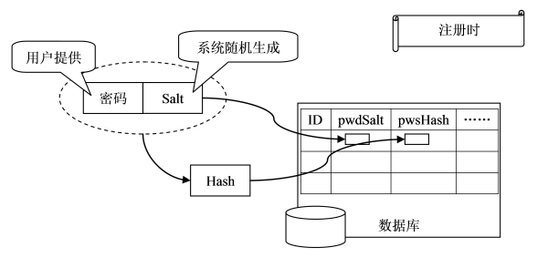
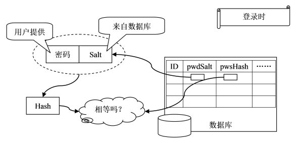

db部分整体以user为例，展示所有的mongoose特性


http://www.scotchmedia.com/tutorials/express/authentication/2/01

## 密码存储手段

下面我列出了常用的密码存储手段，从不安全到安全： 

- 明文存储 
- hash 存储，例如 MD5，SHA，SHA256 
- hash 加盐（salt）存储

1 密码必须散列存储

（内容略）

2 加Salt散列

我们知道，如果直接对密码进行散列，那么黑客（统称那些有能力窃取用户数据并企图得到用户密码的人）可以对一个已知密码进行散列，然后通过对比散列值得到某用户的密码。换句话说，虽然黑客不能取得某特定用户的密码，但他可以知道使用特定密码的用户有哪些。

加Salt可以一定程度上解决这一问题。所谓加Salt，就是加点“佐料”。其基本想法是这样的——当用户首次提供密码时（通常是注册时），由系统自动往这个密码里撒一些“佐料”，然后再散列。而当用户登录时，系统为用户提供的代码撒上同样的“佐料”，然后散列，再比较散列值，已确定密码是否正确。

这里的“佐料”被称作“Salt值”，这个值是由系统随机生成的，并且只有系统知道。这样，即便两个用户使用了同一个密码，由于系统为它们生成的salt值不同，他们的散列值也是不同的。即便黑客可以通过自己的密码和自己生成的散列值来找具有特定密码的用户，但这个几率太小了（密码和salt值都得和黑客使用的一样才行）。

下面详细介绍一下加Salt散列的过程。介绍之前先强调一点，前面说过，验证密码时要使用和最初散列密码时使用“相同的”佐料。所以Salt值是要存放在数据库里的。


图1. 用户注册



如图1所示，注册时，

- 1）用户提供密码（以及其他用户信息）；
- 2）系统为用户生成Salt值；
- 3）系统将Salt值和用户密码连接到一起；
- 4）对连接后的值进行散列，得到Hash值；
- 5）将Hash值和Salt值分别放到数据库中。


图2. 用户登录



如图2所示，登录时，

- 1）用户提供用户名和密码；
- 2）系统通过用户名找到与之对应的Hash值和Salt值；
- 3）系统将Salt值和用户提供的密码连接到一起；
- 4）对连接后的值进行散列，得到Hash'（注意有个“撇”）；
- 5）比较Hash和Hash'是否相等，相等则表示密码正确，否则表示密码错误。


## bcrypt

bcrypt是专门为密码存储而设计的算法，基于Blowfish加密算法变形而来，由Niels Provos和David Mazières发表于1999年的USENIX。

bcrypt最大的好处是有一个参数(work factor)，可用于调整计算强度，而且work factor是包括在输出的摘要中的。随着攻击者计算能力的提高，使用者可以逐步增大work factor，而且不会影响已有用户的登陆。

bcrypt经过了很多安全专家的仔细分析，使用在以安全著称的OpenBSD中，一般认为它比PBKDF2更能承受随着计算能力加强而带来的风险。bcrypt也有广泛的函数库支持，因此我们建议使用这种方式存储密码。

## 安装

```
$ npm install --save bcrypt
```


## 效率对比

```
➜  db git:(master) ✗ node bcrypt.js
bcrypt: 87.910ms
$2a$10$l4USI5VI9a969Pj7RNIu9eARW8w28kV2zmsZzYf9uUOGqlKhtuWCq
➜  db git:(master) ✗ node salt.js 
2db8067936b89f9b8cfa7579b60ecd5b79b391bb4d0f6df67c88afa6ab7527c4be0046ffc8536fb7493bfd1245bafc09ddf9039f2569b2934e4279655bdeb58e09cbcb17d9775ddc2711c454c1d4cefab177eee62be7c6c24c296f10e8c0773e0950f1b3bd6267cc26a5ed26db44cbaaec485294db648d076a2742e09cc9920d
(node:38203) DeprecationWarning: crypto.pbkdf2 without specifying a digest is deprecated. Please specify a digest
crypto: 45.506ms
5ea8b77329087f8c043eb3d8e960ab4140f5a28b533ea7290208f748486627989a4cc654177878a5e6dea32009ddc38217ed90547f10cc120a119d3834404135a2512aec93f96b71fb9d5bfbf1375c1613436b61d17f8ba855a08978487fe5e34af2e2eb0e4c60afe43dd839bb0444ba789c1804c674849911a04b93fdbab1bb4d6fd085406c38f9eceae136984588d316646533cd9a528b89725cf9d03b1bd901dda9e4f954e14c4e63a62e3646b7cf56a418db816e1e981a1067389c86d6321c8dc2576cae6d7fd3cc04ffb27a117278ce4e841e70e1f9b1109932ed7570d6f2605e1bb314dd8b382714d76d562547f08566ebb47e509cdadf70938db95135
```

crypto的时间比bcrypt要好将近1倍。
