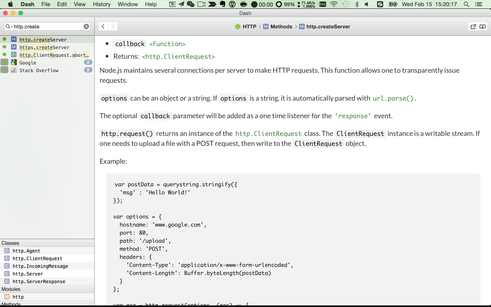

# Api

## 2种风格Api写法

- Error-first callback
- EventEmit

常见的

```
fs.readFile('/etc/passwd', (err, data) => {
  if (err) throw err;
  console.log(data);
});
```

fs.readFileSync

```
fs.readFileSync(file[, options])
```

这个怎么捕获异常呢？


一个EventEmit小例子

```
var EventEmitter = require('events').EventEmitter; 
var event = new EventEmitter(); 

event.on('some_event', function() { 
	console.log('some_event 事件触发'); 
}); 

setTimeout(function() { 
	event.emit('some_event'); 
}, 1000); 
```

- event必须是EventEmitter的实例，包括继承
- emit
- on

之前讲过的http的例子

```
var http = require("http");
http.createServer(function(request, response) {
    response.writeHead(200, {"Content-Type": "text/plain"});
    response.write("Hello World");
    response.end();
}).listen(8888);
```

捕获异常

```
server.on('error', function (e) {
  // Handle your error here
  console.log(e);
});
```

疑问：如果在里面用emit呢？

## 本地api

查询文档

http://zealdocs.org/ (推荐，离线下载)
有很多doc在dash（mac）里默认是没有的；

see here ： http://kapeli.com/docset_links

如果是下载到本地的docset，放到zealdocs目录下面，需要重启zeal



本地缓存文档的好处

- 方便查看，不需要网络即可
- 经常翻查文档，对sdk里的api掌握更好
- 大局观更好

## 总结

- 掌握api写法
- 掌握sdk api查询方法

如果有精力建议翻译一下文档或者更多英文文章，会收益匪浅的。坚持做，相信自己能够做到。
